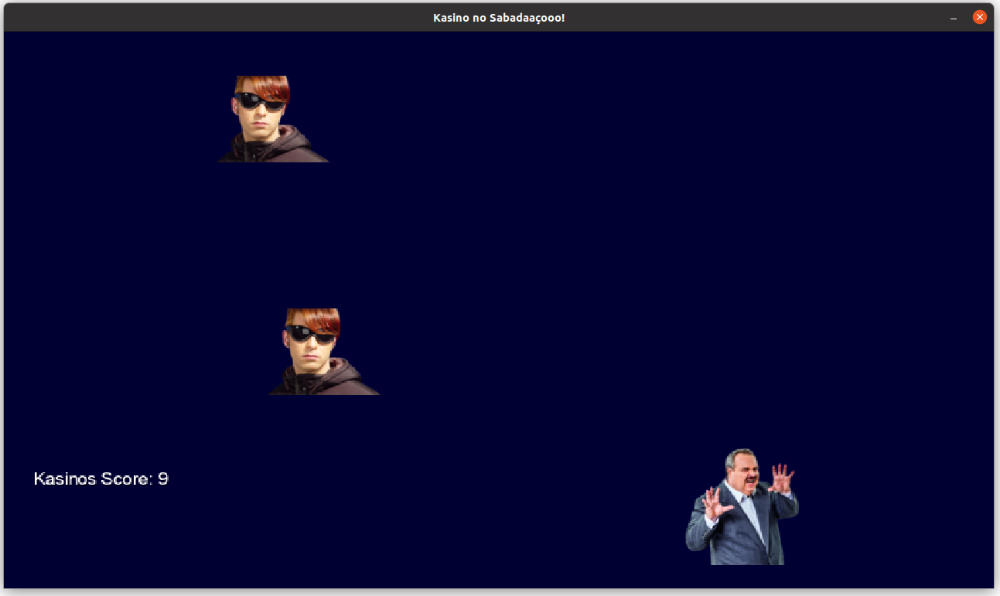

# Kasino

### What is Kasino?

Kasino is a game created without any perspective.

### How far along are you?

Kasino only has basic elements like ~multiplayer and one skill so far.

### What was Kasino built with?

[LibGDX](https://libgdx.com/)

... and LOVE of-course.

### Features

- Catch Kasino's head

### How to play?

Download the latest version [here](https://github.com/gutogirardon/Kasino/releases/download/v0.0.1/kasino.jar)

Execute de jar file:

- java -jar kasino.jar

This project should not be taken seriously.